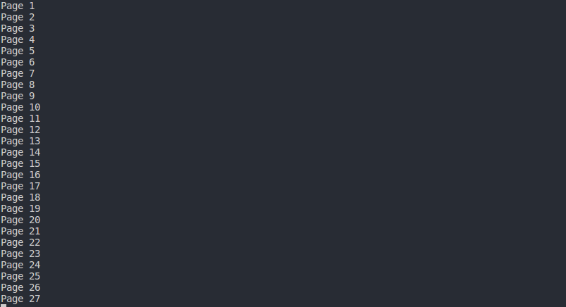

# Description
  Aplikasi Ini digunakan untuk melakukan scraping terhadap data gempa sepanjang maksimal 1 tahun dari situs http://repogempa.bmkg.go.id/

# Specification
  1. Aplikasi ini dapat mencari data tentang gempa dari situs http://repogempa.bmkg.go.id/
  2. Mengolah datanya ke dalam format json

# How to use
  1. Di dalam folder Tugas1 ketik __make__ pada terminal maka proses scraping akan dimulai, file data akan terdapat pada data
  2. jika ingin input manual lingkup daerah gempa bisa dengan menjalankan program src.py pada folder src.py , lalu masukkan input manualnya

# JSON Structure
  Terdiri dari kumpulan __key__ yang berupa nomor data yang unik dan __value__ yang berisi juga key dan value untuk: 
  1. Date         => value tanggal kejadian
  2. Time         => value waktu kejadian
  3. Latitude     => Latitude
  4. Longitude    => Longitude
  5. Depth        => kedalaman
  6. Mag          => Magnitudo, Kekuatan gempa dalam skala richter.
  7. TypeMag      => Tipe magnitudo atau jenis jenis magnitudo gempa.
  8. smaj         => Jarak stasiun terjauh dari episenter.
  9. smin         => Jarak stasiun terdekat dari episenter.
  10. az          => Azimuthal gap, adalah sudut gap antara stasiun stasiun pencatat gempa terhadap epicenter.
  11. rms         => Root Mean Square atau kuadrat rata rata, adalah nilai error perhitungan.
  12. cPhase      => Count Phase, adalah jumlah fase waktu tiba gelombang gempa yang digunakan.
  13. Region      => Wilayah

  ## Contoh JSON structnya
  ```
  {
    "1": {
        "Date": "2017-05-15",
        "Time": "00:35:50.1",
        "Latitude": "-8.13",
        "Longitude": "115.35",
        "Depth": "10",
        "Mag": "2.4",
        "TypeMag": "MLv",
        "smaj": "1.64",
        "smin": "0.14",
        "az": "184",
        "rms": "0.476",
        "cPhase": "8",
        "Region": "Bali Region, Indonesia   "
    },
    "2": {
        "Date": "2017-05-15",
        "Time": "00:56:37.3",
        "Latitude": "0.41",
        "Longitude": "125.88",
        "Depth": "10",
        "Mag": "3.3",
        "TypeMag": "MLv",
        "smaj": "3.82",
        "smin": "1.3",
        "az": "170",
        "rms": "0.687",
        "cPhase": "8",
        "Region": "Northern Molucca Sea   "
    }
  }
  ```


# Screenshot
  

# Reference
  Saya menggunakan Python untuk membuat aplikasi ini dengan beberapa kakas tambahan yaitu:
  - mechanicalsoup , https://github.com/MechanicalSoup/MechanicalSoup
  - BeautifulSoup , https://www.crummy.com/software/BeautifulSoup/bs4/doc/

# Author

  ## by Wildan Dicky Alnatara a.k.a wildansupernova
  